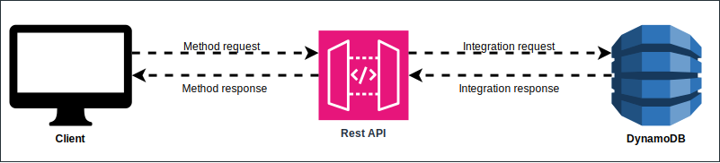

AWS offers a managed service for API Gateway that comes in three flavours: http, rest and websocket. A common pattern of usage of these services are in combination with serverless services like Lambdas, DynamoDB tables, S3, etc. But the rest version of these service is more capable than most people think and using it just as a proxy to a lambda containing all the logic of execution is a waste of potential (and money).

For simple use cases where no logic will run in the API Gateway, the http type is better suited (and even using lambdas new http endpoint feature directly), but if you find yourself in a situation where logic to implement is not too complex, you should know some endpoints logic could be implemented directly with this service.

## What can be done with an AWS Rest API Gateway?

Let's first take a look at some definitions the service has, the interaction within the system is mainly done between a client, the service itself and a external service that will process the information (there are edge cases where the last party is not involved):

<!--  -->


In each of the 4 steps represented with the arrows the API Gateway can execute basic mapping logic (trough the usage of the VTL templating language). This feature combined with the native integrations that this service offers with other AWS services, we can essentially create some apps without the need of a single line of code. Let's take a closer look to each part of this flow.

### Method request

<!--  -->


```hcl
data "aws_region" "current" {}
```
